# EasyAI User Manual

## Overview

EasyAI is a Windows desktop application that gives you a simple, plain-language
front end for ComfyUI — the node-based engine that powers many local
Stable-Diffusion-style AI tools. Instead of building node graphs, you pick a
"style" (a pre-built workflow), type a description of what you want, choose a
shape, and press Create. EasyAI handles talking to ComfyUI, shows you a live
preview while your image or video is being generated, and saves the finished
result for you.

EasyAI is built for people who want to use AI image, video, and prompt-writing
tools without learning ComfyUI's node editor — hobbyists, artists, and anyone
who has a ComfyUI installation (or is willing to install one) and wants a
friendlier way to drive it. It has three main tabs — **Image**, **Video**, and
**Prompt Helper** — each built around the same "pick a style, describe it,
choose a shape, press Create" idea.

EasyAI does not include ComfyUI itself. You either point EasyAI at a ComfyUI
installation you already have, or use the separate **EasyAI Setup** tool
(covered near the end of this manual) to download and install one.

---

## Installation & Requirements

**Operating system:** EasyAI is built and tested for Windows. (Some
non-Windows code paths exist in the app, but the documented, supported way to
install and launch EasyAI is on Windows.)

**Python:** version 3.10 or newer. The launcher checks this on startup and
will show an on-screen message and refuse to continue if your Python is too
old.

**Python packages** (installed automatically the first time you run EasyAI —
see below): `PySide6`, `requests`, `websocket-client`, `Pillow`.

**A working ComfyUI installation.** EasyAI is a front end for ComfyUI, not a
replacement for it — it needs a ComfyUI folder to point at. If you don't
already have one, run the separate **EasyAI Setup** program described in
[EasyAI Setup (companion installer)](#easyai-setup-companion-installer) to
download and install one.

**Graphics hardware:** image and video generation is GPU-intensive, and
EasyAI shows VRAM warnings as you increase detail/length, but the project
does not state an official minimum GPU, VRAM amount, or whether CPU-only use
is supported.

<!-- TODO: confirm minimum GPU/VRAM requirements and whether CPU-only mode is supported -->

### Installing EasyAI

1. Install Python 3.10 or newer. When the Python installer asks, tick
   **"Add python.exe to PATH."**
2. Get a copy of the EasyAI folder (from wherever you obtained it) onto your
   computer.
3. Start EasyAI by double-clicking the **EasyAI** shortcut, or by running
   `python EasyAI.py` from a command prompt in the EasyAI folder.
4. The first time you launch it, EasyAI notices that its required packages
   aren't installed yet and installs them for you automatically. A console
   window appears briefly for this one-time step; after that, EasyAI always
   opens without a console window in the background.

<!-- TODO: confirm whether end users are ever expected to run a packaged .exe build (via Build EXE.bat) instead of launching from source, and if so, document that install path here -->

---

## First-Run Setup

The very first time you open EasyAI (before you have ever used it), the app
does two things automatically, in order:

1. Shows a one-time welcome message telling you it has guessed where your
   ComfyUI installation lives.
2. Opens the **Settings** window automatically so you can check — and if
   needed, correct — that guess before you try to create anything.

You only see this automatic flow once. After that, you can always reach
Settings yourself from **File → Settings…**.

See [First-run Welcome](#first-run-welcome) and [Settings](#settings) below
for what each of these screens looks like and what to do on them.

---

## Feature Walkthrough

### First-run Welcome

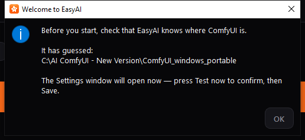

This message box appears only once, the very first time you open EasyAI. It
tells you that EasyAI has made a guess at where ComfyUI is installed on your
computer, and that the Settings window is about to open so you can confirm or
correct that guess.

**What to do:**

1. Read the guessed folder path shown in the message.
2. Click **OK**.
3. The Settings window opens next — go to [Settings](#settings) below and use
   **Test now** to check whether the guessed folder is actually correct
   before you close it.

You don't need to change anything on this screen itself; it's just a heads-up
before Settings opens.

---

### Settings

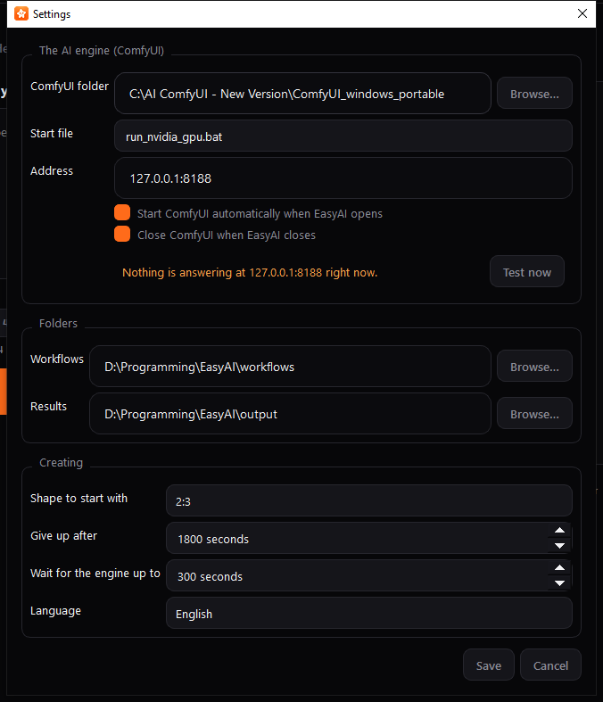

Settings is where you tell EasyAI where ComfyUI lives, how it should be
started, where your workflows and results are stored, and a few generation
defaults. You can open it any time from **File → Settings…** (or the keyboard
shortcut `Ctrl+,`).

**What to do:**

1. **ComfyUI folder** — Click **Browse…** and select the folder your ComfyUI
   installation lives in, if the pre-filled path isn't correct.
2. **Start file** — Choose which `.bat` file inside that folder should be
   used to start ComfyUI (EasyAI lists every `.bat` file it finds in the
   folder). If you have an NVIDIA GPU, a launcher with "nvidia" in its name
   is usually the right pick, and EasyAI tries to put likely choices at the
   top of the list.
3. **Address** — Leave this as `127.0.0.1:8188` unless you know your ComfyUI
   server runs somewhere else.
4. Tick or clear **"Start ComfyUI automatically when EasyAI opens"** and
   **"Close ComfyUI when EasyAI closes"** depending on how you want ComfyUI's
   lifecycle managed. The second option only ever closes a ComfyUI process
   that EasyAI itself started — it will never close a copy of ComfyUI you
   started yourself.
5. Click **Test now** to check the connection. The status line below turns
   green and says "ComfyUI is answering at …" if everything is set up
   correctly; otherwise it shows a warning explaining what's wrong.
6. Under **Folders**, confirm or change the **Workflows** folder (where your
   exported workflow files live) and the **Results** folder (where finished
   images/videos are saved).
7. Under **Creating**, set your preferred starting shape, and how long EasyAI
   should wait before giving up on a stuck generation or a slow-starting
   engine.
8. Choose your **Language** from the dropdown if you want the app in a
   language other than the default.
9. Click **Save** to apply your changes (this happens immediately, with no
   restart needed), or **Cancel** to discard them.

If you change the ComfyUI folder, start file, server address, or workflows
folder, EasyAI automatically re-checks the connection and reloads your
workflow lists for you when you close this window.

<!-- TODO: confirm whether a dark/light theme toggle exists anywhere in the app; no such control was found in the Settings window during manual preparation, so it is not documented as a user-facing control here -->

---

### Startup Splash

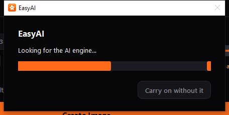

This small progress window appears while EasyAI is looking for, or starting,
the ComfyUI engine — so you're never staring at a window that looks frozen.
You'll typically only see it right after launching EasyAI, and only if
ComfyUI isn't already running.

**What to do:**

- Just wait. EasyAI is either checking whether ComfyUI is already running, or
  launching it for you using the start file you chose in Settings.
- If you don't want to wait, click **Carry on without it**. The main EasyAI
  window opens right away, but you won't be able to generate anything until
  the engine connects.
- If ComfyUI fails to start in time, EasyAI shows a message explaining that
  the app is still usable for browsing your workflows, but not for creating
  anything, until the engine is available.

---

### Main Window

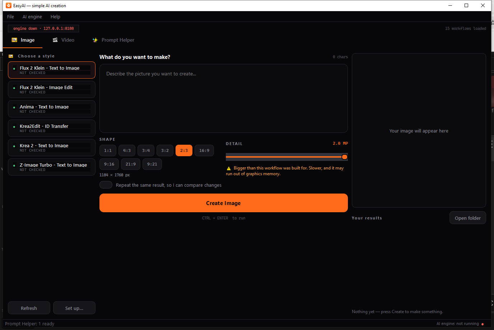

This is the main EasyAI window you'll spend most of your time in. Across the
top is a menu bar and an engine status strip; below that are the three
generation tabs; at the bottom is a status bar.

**What you see:**

- **Menu bar** — **File** (open your workflows/results folders, Settings,
  Quit), **AI engine** (check connection, start the engine, reload
  workflows), and **Help** (quick reference and About).
- **Engine status strip** — a pill showing whether the engine is live (green,
  with the address it's answering on) or down (red), plus a count of loaded
  workflows.
- **Tab bar** — switch between **Image**, **Video**, and **Prompt Helper**.
- **Status bar** (bottom) — shows VRAM usage while the engine is running and
  reporting a graphics device, a coloured dot with "AI engine: running / not
  running," and brief status messages.

**Useful keyboard shortcuts:**

| Shortcut | Action |
|---|---|
| `Ctrl+Enter` / `Ctrl+Return` | Run Create on whichever tab you're viewing |
| `Ctrl+,` | Open Settings |
| `F5` | Check that the engine is running |
| `Ctrl+R` | Reload the workflow lists |

A workflow list showing every entry as "NOT CHECKED" and an engine status of
"not running" simply means EasyAI hasn't yet connected to a live ComfyUI
server — as soon as ComfyUI is running and reachable, EasyAI automatically
re-checks each workflow and updates its status.

EasyAI remembers your window size and position between sessions. When you
close the window, any generation job in progress is cancelled, and — if you
left "Close ComfyUI when EasyAI closes" turned on in Settings — any ComfyUI
process EasyAI itself started is shut down for you.

---

### Image tab

The Image tab is where you generate still images. It's arranged in three
columns: your list of styles on the left, your prompt and options in the
middle, and a preview plus your results on the right.

**What to do:**

1. **Choose a style** — In the left-hand list, click the workflow you want to
   use. Each entry shows a status dot and a short label:
   - **READY** (green) — ready to use.
   - **CHECK SET UP** / **NOT CHECKED** (amber) — EasyAI guessed how this
     workflow works, or hasn't checked it against a live engine yet.
   - **MISSING ADD-ON** / **MISSING MODEL** (red) — something this workflow
     needs isn't installed in your connected ComfyUI.
   - **NEEDS RE-EXPORT** (red) — see
     [Troubleshooting](#a-workflow-says-needs-re-export).
   - If the list is empty, EasyAI tells you which folder to save exported
     workflow files into, then press **Refresh**.
2. **Describe what you want** — Type your description into the prompt box.
   A character counter above the box tracks your typing.
3. **Attach files, if the style needs them** — Some styles show one or more
   file boxes for pictures, sound, or video. Click a box (or drag a file onto
   it) to attach a file; click **Remove** to clear it. Boxes marked
   "(optional)" can be left empty.
4. **Pick a Shape** — Click one of the ratio buttons (e.g. `1:1`, `16:9`) to
   set the output's proportions. The exact pixel size appears underneath.
5. **Adjust Detail**, if shown — Drag the slider to trade off quality against
   speed and memory use. A hint line under the slider tells you what the
   current value means; an amber warning appears if you go high enough that
   it may run out of graphics memory.
6. **Turn on "Repeat the same result"** if you want to keep the same random
   seed across runs (useful for comparing small changes to your prompt).
7. Click **Create Image** (or press `Ctrl+Enter`). A progress bar appears
   while EasyAI generates your image, and a live preview shows ComfyUI's
   in-progress frames.
8. When it's done, your image appears in the preview pane and is added to
   **Your results** below it. Double-click a result to open it, or click
   **Open folder** to see all your saved images in Windows Explorer.

If you press Create while the engine isn't running, or while a required file
is missing, EasyAI shows a message telling you what to fix instead of sending
a broken job to ComfyUI.

---

### Video tab

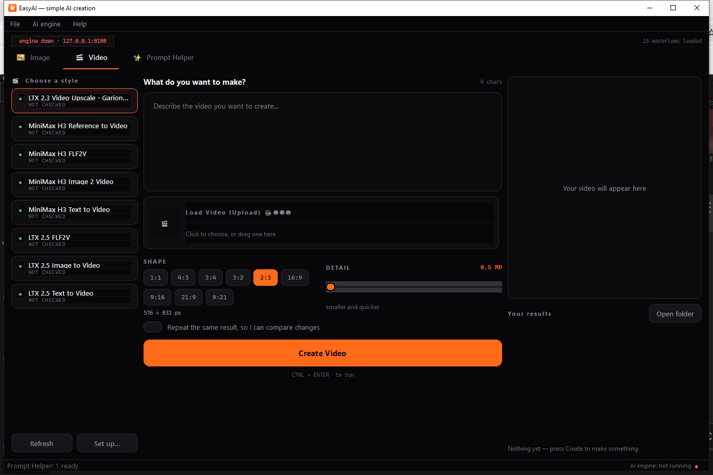

The Video tab works the same way as the Image tab, with a few
video-specific differences.

**What's different from Image:**

- Some video styles need a starting picture or clip — attach it in the file
  box provided (for example, "Load Video (Upload)").
- A **Length** control (in seconds) sets how long the finished video will be;
  the equivalent frame count is shown underneath. Longer videos use
  noticeably more graphics memory — an amber caution appears once you pass a
  set threshold.
- The **Create Video** button carries a tooltip reminding you that video
  generation takes much longer than a still image.
- While a job is running, the Create button is replaced with a **Stop**
  button, which cancels the current job.

Otherwise, choosing a style, writing a prompt, picking a shape/detail level,
and viewing your results work exactly as described in
[Image tab](#image-tab) above.

---

### Prompt Helper tab

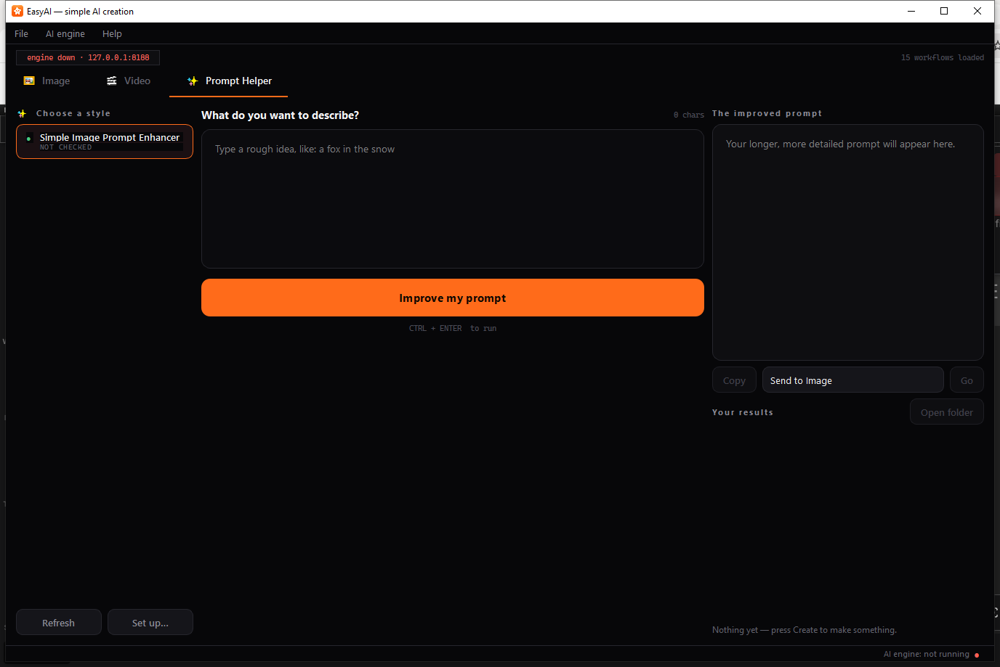

The Prompt Helper tab doesn't generate a picture or video — it takes a short,
rough idea and expands it into a longer, more detailed prompt you can reuse
on the Image or Video tab.

**What to do:**

1. Choose a style from the list on the left (there is usually just one:
   a prompt-enhancer style).
2. Type a short idea into the box — for example, "a fox in the snow."
3. Click **Improve my prompt** (or press `Ctrl+Enter`).
4. The expanded result appears on the right, under **The improved prompt**.
5. From here you can:
   - Click **Copy** to copy the text to your clipboard.
   - Choose **Send to Image** or **Send to Video** from the dropdown, then
     click **Go**, to drop the improved prompt straight into that tab's
     prompt box and switch to it.
   - Click any entry in your history list to reload a prompt you improved
     earlier in a previous session.

If a workflow finishes without producing any readable text, see
[Troubleshooting](#prompt-helper-produced-no-text) below.

---

### Set up… (Manifest Editor)

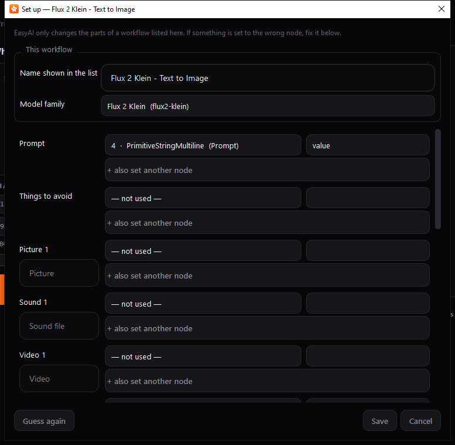

The Manifest Editor lets you correct EasyAI's automatic guesses about which
parts of a workflow correspond to the prompt box, shape, seed, and so on —
without having to edit any files by hand.

**When you'll see this:** click **Set up…** below a style list, right-click a
style and choose **Set up…**, or follow the prompt when a style is flagged
**CHECK SET UP**.

**What to do:**

1. If EasyAI had to guess some of these settings, an amber note near the top
   names which ones — worth double-checking those first.
2. Give the workflow a friendly **Name shown in the list**, if you'd like one
   other than the file name.
3. Set **Model family** if you know which engine the workflow was built for,
   or leave it on "Work it out automatically."
4. For each row (Prompt, Things to avoid, Width, Seed, and so on), use the
   dropdowns to pick which node — and which input on that node — EasyAI
   should control. Use **"+ also set another node"** if a single value (like
   width) needs to be written to more than one place in the workflow.
5. Click **Save** to apply your changes, **Cancel** to discard them, or
   **Guess again** to have EasyAI re-run its automatic detection and start
   over (this doesn't save until you click Save).

Your corrections are saved next to the workflow file and are **not**
overwritten if you re-export the same workflow from ComfyUI later — so you
only need to fix a given workflow's setup once.

---

### Rename dialog

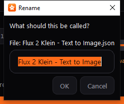

Use this to give a workflow a friendlier name in the style list than its raw
file name.

**How to reach it:** select a workflow and press `F2`, double-click it, or
right-click it and choose **Rename…**.

**What to do:**

1. Type the new name you want shown in the style list.
2. Click **OK** to save it, or **Cancel** to leave it unchanged.

The custom name is stored separately from the file itself, so re-exporting
the same workflow later from ComfyUI won't lose your renamed label. Clearing
the name back to blank makes EasyAI fall back to showing the file name.

---

### Help menu

EasyAI's **Help** menu has two entries, both simple reference dialogs.

#### How do I add a workflow?

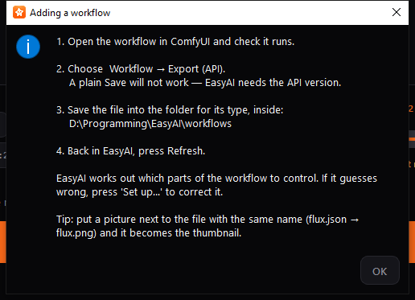

A quick, in-app reminder of the steps for adding a new style to EasyAI:

1. Open the workflow in ComfyUI and make sure it runs.
2. Choose **Workflow → Export (API)** in ComfyUI — a plain Save will not
   work; EasyAI needs the API version of the file.
3. Save the exported file into the matching folder inside your workflows
   folder (the exact path is shown live in this dialog).
4. Back in EasyAI, click **Refresh**.

EasyAI then works out which parts of the workflow it can control
automatically. If it guesses something wrong, use **Set up…** to correct it
(see [Set up… (Manifest Editor)](#set-up-manifest-editor) above). As a tip,
placing a picture next to the exported file with a matching name (for
example, `flux.json` and `flux.png`) makes EasyAI use that picture as the
style's thumbnail.

#### About EasyAI

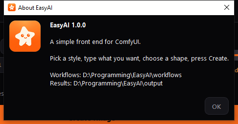

Shows the installed EasyAI version, a one-line description, and the current
location of your workflows and results folders — handy if you've forgotten
where you pointed them in Settings.

---

### EasyAI Setup (companion installer)

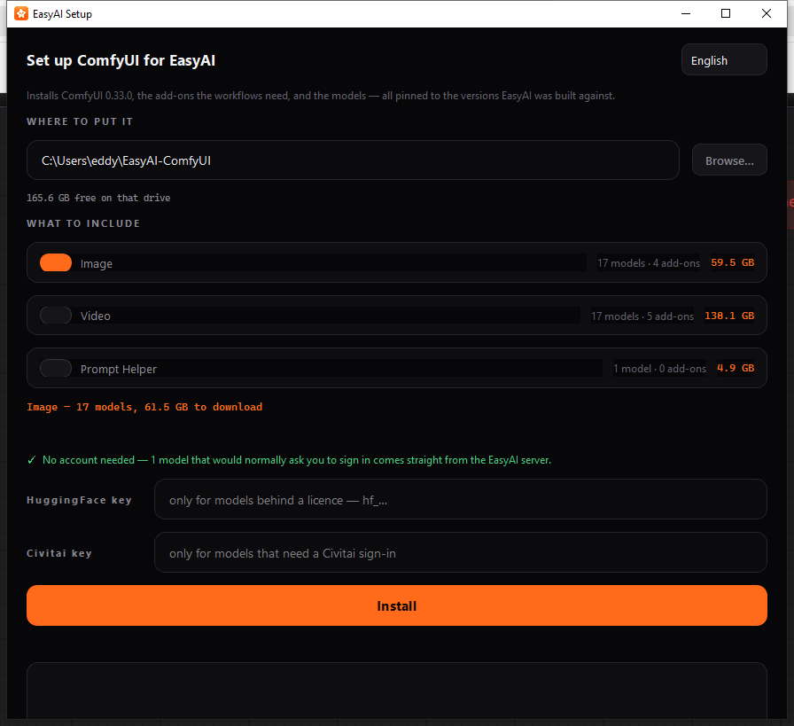

> **Note on scope:** EasyAI Setup is a separate program from EasyAI itself —
> it has its own shortcut/launcher and never reads or changes EasyAI's own
> settings. It's included here as a companion tool because, in practice, a
> first-time user with no ComfyUI installation would likely need to run it
> before opening EasyAI at all. If you already have a working ComfyUI
> installation, you can skip this section and just point EasyAI at it from
> [Settings](#settings).

EasyAI Setup downloads and installs a specific, known-good version of
ComfyUI, along with the add-ons and models that EasyAI's built-in workflows
expect, into a folder you choose.

**What to do:**

1. If needed, change the app's language using the dropdown in the top-right
   corner.
2. Under **WHERE TO PUT IT**, confirm or change the install location using
   **Browse…**. The free disk space on that drive is shown underneath.
3. Under **WHAT TO INCLUDE**, turn on the toggle for each group of features
   you want (for example, Image, Video, Prompt Helper). Each group shows how
   many models and add-ons it includes and its download size; a running
   total is kept as you toggle groups on and off. Watch for amber warnings
   about insufficient disk space or models that need special handling, and
   green notes where no account is required.
4. If a model needs a Hugging Face or Civitai account, enter your access key
   in the matching field. These keys are used only for that install run and
   are never saved to disk.
5. Click **Install**. A confirmation dialog shows the exact download size and
   destination before anything downloads.
6. Watch the progress bar, current file/speed readout, and the log for
   status. Click **Stop** if you need to pause — downloads resume where they
   left off the next time you click Install.

Once installation finishes, open EasyAI, go to **Settings**, and point the
**ComfyUI folder** at the location you installed to here.

---

## Settings Reference

These settings are stored automatically as you use the app. Most are set
from the [Settings](#settings) window; a few are remembered in the background
as you use the Image/Video/Prompt Helper tabs and aren't edited directly.

| Setting | What it does | Default |
|---|---|---|
| ComfyUI folder | Folder where your ComfyUI installation lives. | `C:\AI ComfyUI - New Version\ComfyUI_windows_portable` |
| Start file | Which `.bat` file inside that folder EasyAI runs to start ComfyUI. | `run_nvidia_gpu.bat` |
| Address | The `host:port` EasyAI talks to ComfyUI on. | `127.0.0.1:8188` |
| Start ComfyUI automatically when EasyAI opens | Whether EasyAI launches ComfyUI itself if nothing answers at startup. | On |
| Close ComfyUI when EasyAI closes | Whether EasyAI shuts down a ComfyUI process it started, when you quit EasyAI. Never affects a copy of ComfyUI you started yourself. | On |
| Give up after (job timeout) | How long EasyAI waits for a single generation before giving up on it. | 1800 seconds (30 minutes) |
| Wait for the engine up to (launch timeout) | How long EasyAI waits for ComfyUI to finish starting before giving up. | 300 seconds (5 minutes) |
| Workflows folder | Folder holding your exported workflow files, organized by type. | `<EasyAI folder>/workflows` |
| Results folder | Folder your generated images/videos are saved into. | `<EasyAI folder>/output` |
| Shape to start with | The shape chip pre-selected when you pick a new style. | `2:3` |
| Repeat the same result (seed lock) | Whether "repeat the same result" starts turned on. Remembered separately per tab so locking one tab doesn't reuse another tab's seed. | Off |
| How many (batch count) | Default number of images/videos requested per run, when a style supports it. | 1 |
| Let the AI improve my wording first | Default state of the prompt-enhancer switch, when a style has one. | On |
| Detail (Image) | Remembered detail/megapixel level for the Image tab. | 1.0 MP |
| Detail (Video) | Remembered detail/megapixel level for the Video tab. | 0.5 MP |
| Detail warning threshold (Image) | Detail level above which the Image tab shows a memory-cost warning. | 1.5 MP |
| Detail warning threshold (Video) | Detail level above which the Video tab shows a memory-cost warning (lower than Image, since video pays the cost per frame). | 1.0 MP |
| Length (default) | Starting value of the Length control on the Video tab. | 5 seconds |
| Length (minimum / maximum) | Allowed range for the Length control. | 2 / 15 seconds |
| Length warning threshold | Video length above which EasyAI shows a memory-exhaustion caution. | 8 seconds |
| Language | The app's current display language. | English (`en`) |
| Window size and position | Remembered automatically so EasyAI reopens the way you left it. | (none until first saved) |
| First-run flag | Internal marker for whether the first-run welcome/Settings flow has already been shown. | Off (until first launch completes) |

<!-- TODO: confirm whether a dark/light theme setting is genuinely user-facing anywhere in the app, or is fixed/internal only — no theme control was found in the Settings window during manual preparation, so "theme" is intentionally omitted from this table as a user-adjustable setting -->

---

## Troubleshooting

**The workflow list shows everything as "NOT CHECKED."**
This is normal until EasyAI has connected to a running ComfyUI server —
EasyAI can't confirm a style's requirements are met until it can actually ask
ComfyUI what's installed. Start ComfyUI (or let EasyAI start it for you) and
the statuses will update once the engine connects. Use `F5` or **AI engine →
Check it is running** to force a re-check.

**A style is greyed out and says "MISSING ADD-ON" or "MISSING MODEL."**
The connected ComfyUI installation is missing a custom node or model file
this workflow needs. The status text names the missing add-on or model file —
install it into your ComfyUI installation (or use EasyAI Setup if you're
setting up from scratch), then press **Refresh**.

**A workflow says "NEEDS RE-EXPORT."** {#a-workflow-says-needs-re-export}
ComfyUI's plain **Save** does not produce a file EasyAI can use. Open the
workflow in ComfyUI and use **Workflow → Export (API)** instead, then replace
the file in your workflows folder and press **Refresh**. EasyAI deliberately
does not trust a workflow's "last run" data embedded from a plain save,
because in practice that embedded copy is very often out of date.

<!-- TODO: confirm the exact on-screen error text EasyAI shows for this case -->

**"EasyAI cannot reach ComfyUI" when you press Create.**
The engine isn't running or isn't reachable at the address in Settings. Check
the engine status pill at the top of the main window; open **Settings** and
click **Test now**, or use **AI engine → Start it now**.

**"ComfyUI closed straight away."**
The `.bat` file EasyAI tried to launch exited immediately — usually a sign of
a broken or incomplete ComfyUI install. Try running that same `.bat` file
directly (outside EasyAI) to see the actual error ComfyUI reports.

**"The AI engine did not start within N seconds."**
ComfyUI took longer to start than the "Wait for the engine up to" setting
allows. Try running the `.bat` file by hand to see what's happening, or
increase the wait time in Settings.

**"Almost there" dialog when you press Create.**
A required file input (a picture, sound, or video slot) is still empty. Fill
in the listed slot(s) and try again.

**Prompt Helper says "The workflow finished but produced no text."** {#prompt-helper-produced-no-text}
The underlying workflow doesn't have a node set up to show its output text.
This typically needs fixing in the workflow itself (via ComfyUI), or by
checking the workflow's setup with **Set up…**.

**"The AI engine finished but produced no files."**
Either the workflow has no node configured to save its output, or the job
was stopped before it finished. Check the workflow's setup, or try running it
again without stopping it.

**The finished image/video's size doesn't exactly match the Shape you
picked.**
Some engines round the final width and height to a multiple of a fixed grid
size after computing your requested shape, so the saved file can be a few
pixels off from the label on the shape chip. This is expected behavior for
those engines, not an error.

**Detail slider won't go as low as you expect.**
Some workflows are built with a lower minimum than EasyAI's normal range;
EasyAI keeps that workflow's own lower floor instead of rounding it up, so it
doesn't change a result the workflow's author tuned or risk running the
workflow the way it wasn't designed for.

**A file slot that looks optional in ComfyUI is still required in EasyAI.**
EasyAI only marks a file slot as safely skippable when it can confirm, from a
live ComfyUI connection, that every input relying on it is optional. Without
a live connection to check, EasyAI plays it safe and still asks for the file.

**My first-run guess at the ComfyUI folder was wrong.**
This is exactly what the first-run welcome message and **Test now** button in
Settings are for — open **Settings**, browse to the correct folder, and click
**Test now** to confirm before saving.
